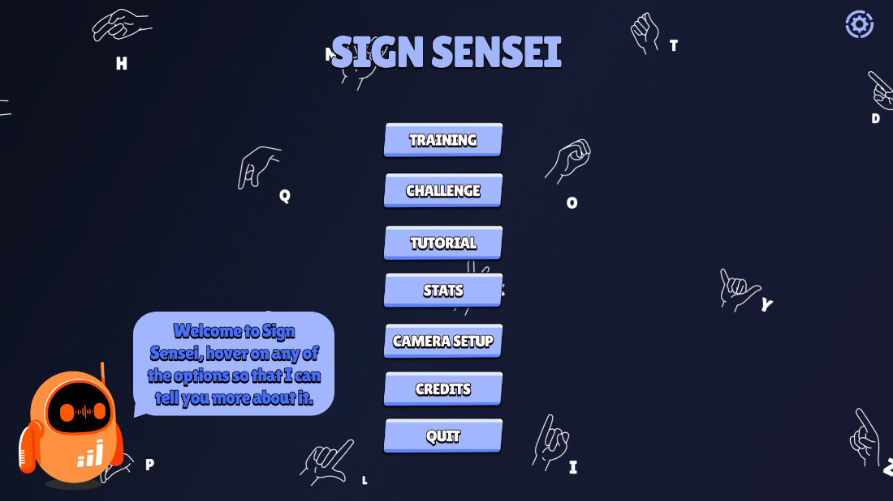
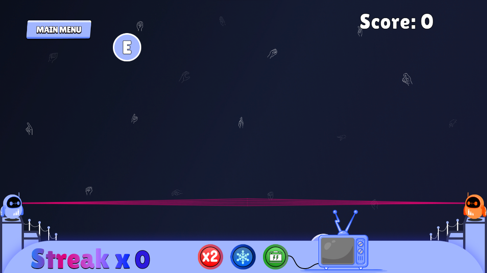

# SignSensei

This is the final year project, where we have developed an educational game that teaches players the sign language in a fun and interactive way.

# Tech Stack

1. Frontend - Unity
2. Backend - Flask & TensorFlow

# How to setup backend

- Initially, run the setup.sh file `bash setup.sh`
- For local usage, run the local.sh file `bash local.sh`
- For production usage, run the main.sh file `bash main.sh`

<b>Note:</b> `The setup.sh` file should be run before running the `main.sh` or `local.sh` to ensure that the application dependencies have been installed properly.

- The app.py file has a `--headless` option to run in headless (windowless) mode.

# Contributors

- [Ashish Kishore](https://github.com/Ashish4869) - Game Design and Development
- [Godnon Dsilva](https://github.com/godnondsilva) - AI and Backend Programming
- [Errol Ken Pereira](https://github.com/Errolken) - Art and UI Design
- [Binse Varghese](https://github.com/Binse13) - Music and Quality Assurance

# Screenshots

